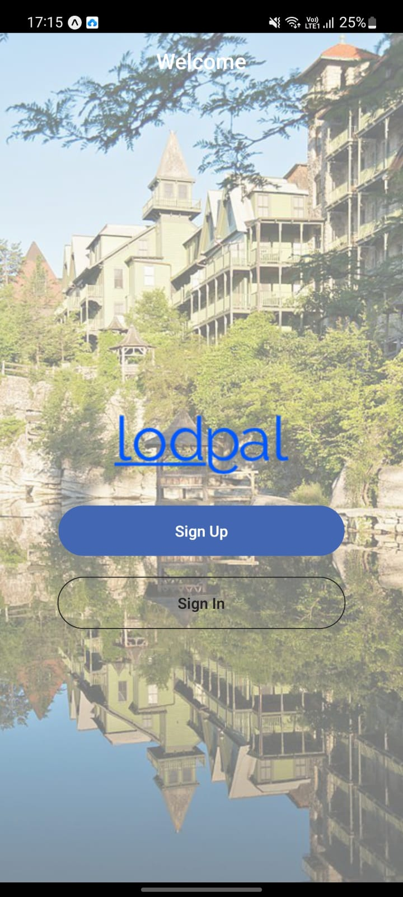
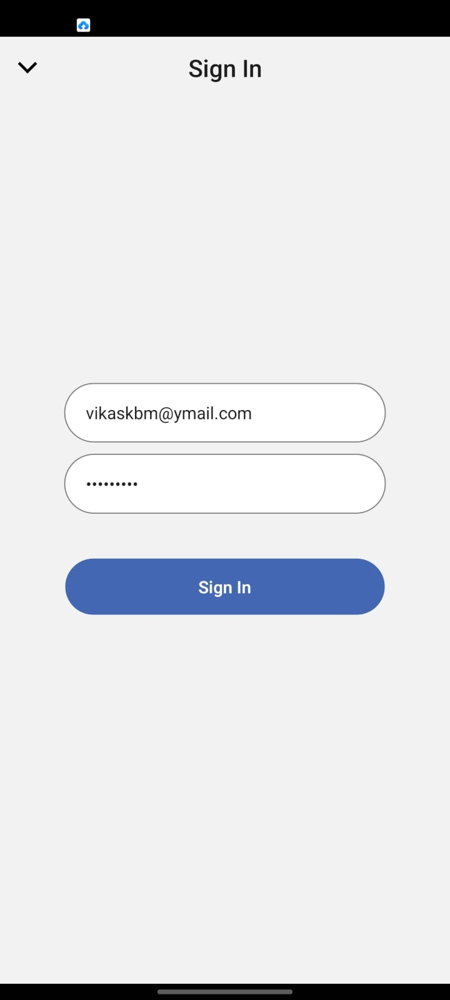
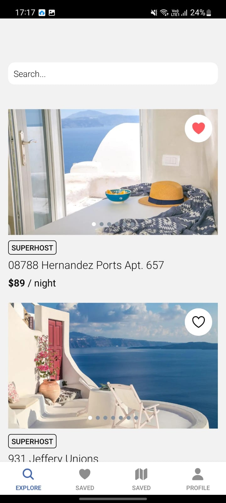
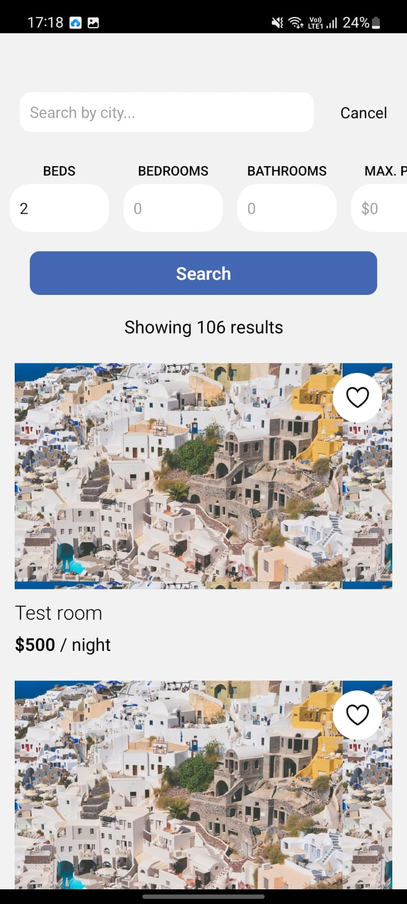
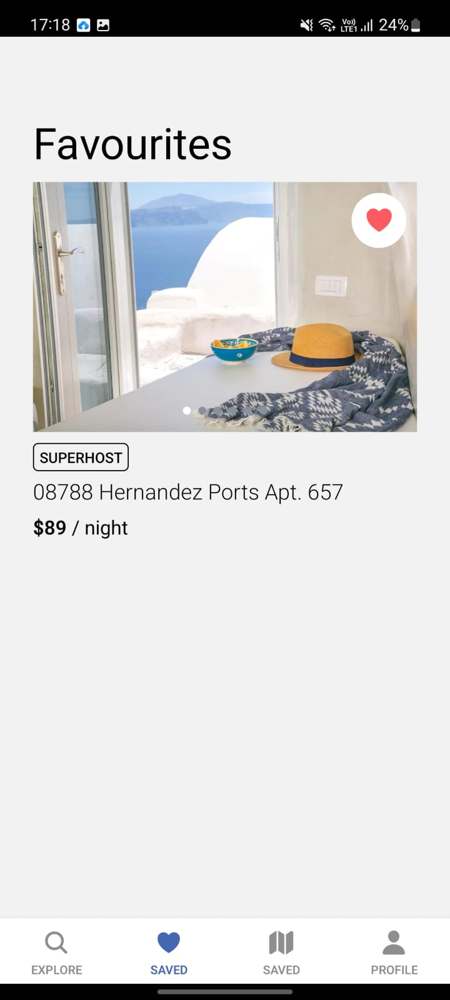

# vaarta

## About

LodgePal is a full stack mobile application. In the app, users can search and book different room with strangers or alone as per their requirement and budget.
Users can create and update account by logging onto on the app.

> The main technologies used in order to bring the application to realization are

- Django
- React Native
- Styled components
- The backend of the application is written in Django and GraphQL api are consumed in the froneend
- The UI and interactive functions of the applications will be coded in JSX and javascript.

> JavaScript will be used with JSX to write react components and functions. Most of the code written will be in JavaScript.

## Images

1. Welcome Screen

2. Login Screen

3. Home Page

4. Search Screen

5. Favourites Chat

## Future Plans

This project can further be developed to allow users to book rooms with other people. It can also be modified to allow only single person bookings also.
Users can favourate and update their profile.
An option to search rooms by different filters is also provided.
